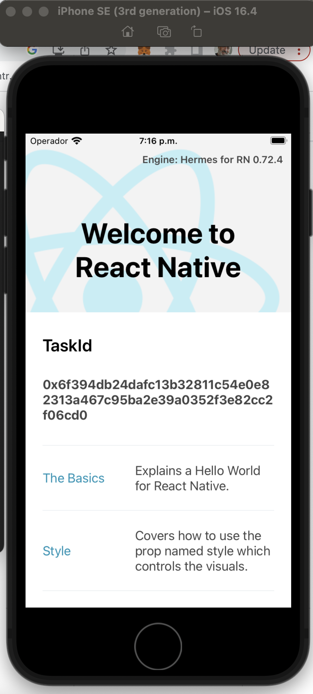
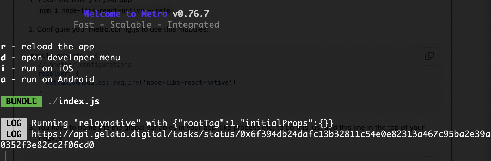

# Minimal React Native with relay-sdk implementation

**known issues*

The ethers library have some bugs with babel, in order to overcome this, we have updated index.js, babel.config.js and metro.config.js following [this](https://github.com/ethers-io/ethers.js/issues/3996#issuecomment-1555264646)

I've followed this [guide](https://reactnative.dev/docs/environment-setup) and include the relay call (CallWithSyncFee) within the initilal [useEffect()](/App.tsx#L74)


In my case: IOS

## Step 1: Start
```bash
yarn npx react-native run-ios
```

This command wil open a simulator and a development server where we can see the logs. The taskId will be console logged and also display in the UI







The taskId shown in the screenshot is [https://api.gelato.digital/tasks/status/0x6f394db24dafc13b32811c54e0e82313a467c95ba2e39a0352f3e82cc2f06cd0](https://api.gelato.digital/tasks/status/0x6f394db24dafc13b32811c54e0e82313a467c95ba2e39a0352f3e82cc2f06cd0)